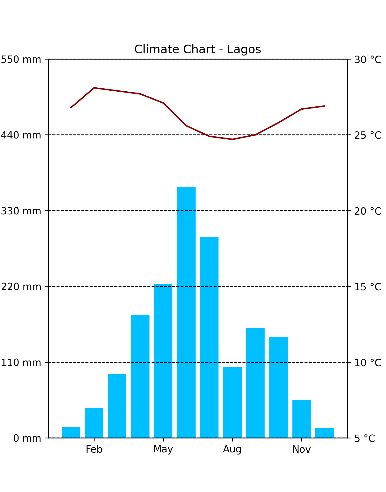
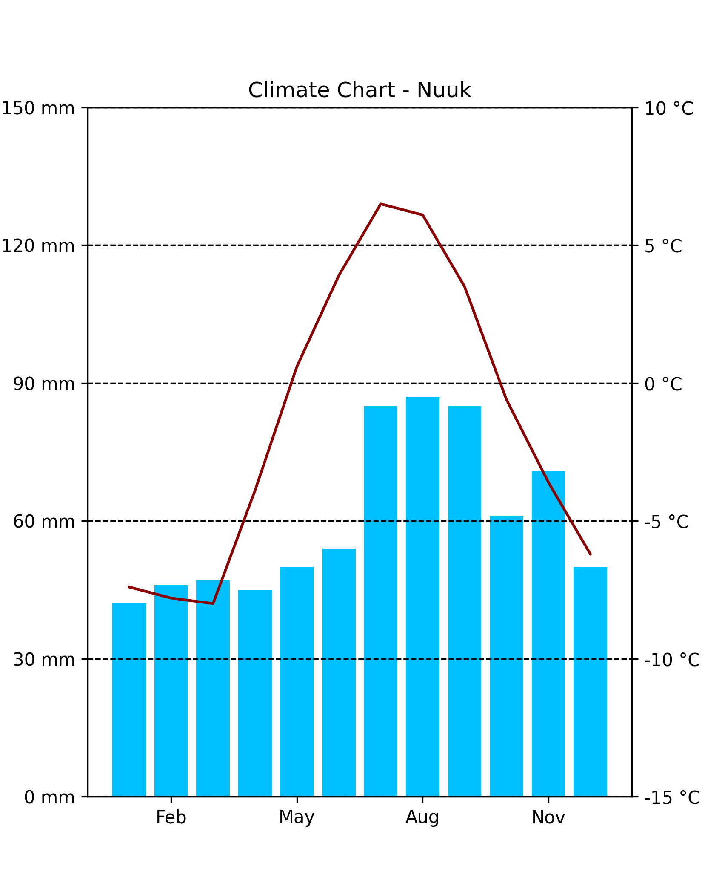
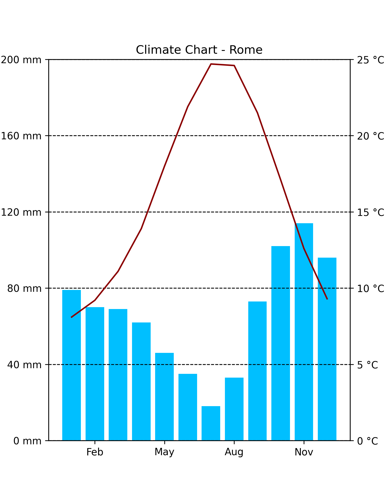
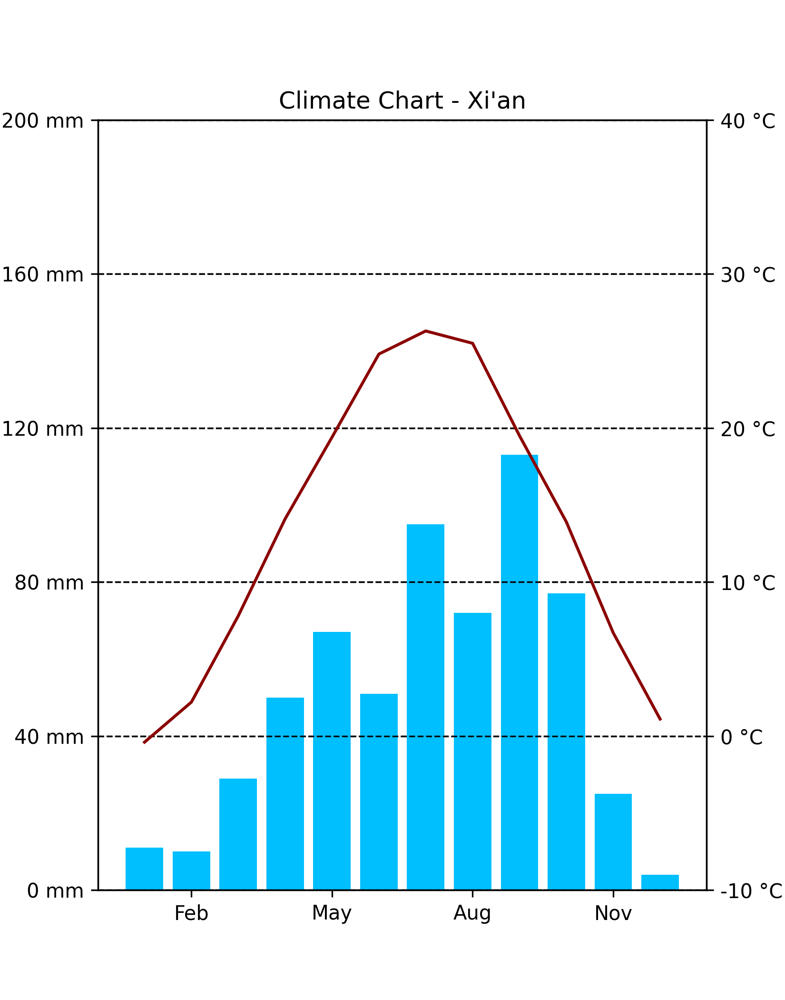

## Climate Chart [WIP]

This is a web service to generate climate charts from the given data.

The charts are similar to these in the middle school geography textbooks in mainland China.

Using Flask and Matplotlib

### Examples

|            Lagos            |           Nuuk            |
|:---------------------------:|:-------------------------:|
|  |  |

|            Romes            |            Xi'An            |
|:---------------------------:|:---------------------------:|
|  |  |
